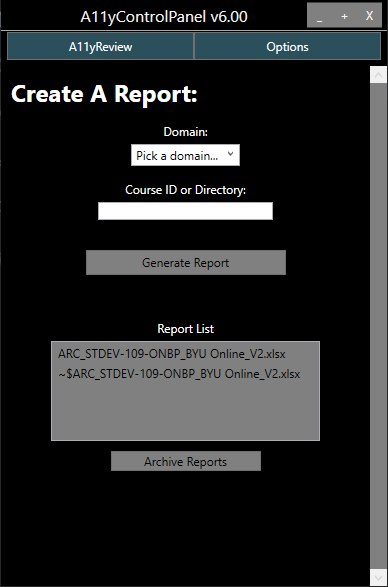

# How to install the Accessibility Panel on a work computer

1.	Go to `M:\DESIGNER\Content Editors·ELTA\Accessibility Assistants\A11y Panel`, open the `AccessibilitySetup` folder, and run the `RunSetUp.exe` file.
     - Make sure to enter Y for everything. You can enter A for yes to all.
2.  After the `RunSetUp.exe` has finished running, you will find a new shortcut on your screen titled `Accessibility Panel` and a new folder titled `AccessibilityTools`. Everything the `RunSetUp.exe` downloaded is contained on that folder on your desktop.
3.	To run the panel click on the new shortcut titled `Accessibility Panel`
    - Running the panel using the shortcut will automatically check for updates upon starting.
4.	Once the panel is running you need to setup the options. Navigate to the `Options` tab in the top right of the window. This will open a text editor we can use to input required values.
    - Many of values should already be filled in. In order for the panel to generate a report, you will need to enter in your user specific token for each BYU Canvas domain.
    - For example
      - ```json
        "BYUOnlineCreds":  {
                           "BaseUri":  "https://byu.instructure.com",
                           "Token":  "<YOUR-USER-TOKEN-GOES-HERE>"
                           },
        ```
    - Go to `Canvas API Token` if you are unsure about how to get a Canvas API token for each of the BYU Canvas domains.

## How to find the Course ID

The course ID is found in the URL after the domain and the word "courses" (example: [https://byuismastercourses.instructure.com/courses/**1335**](https://byuismastercourses.instructure.com/courses/1335)).

To generate report, place the course ID (**1335** for the example) in the form field and select "Generate Report". Remember to select a domain for the course chosen. **A report will not be generated unless a domain is selected.**

## How to find the Correct Directory Path

The panel can make an accessibility report for a folder of HTML files. To create this report you would find the file path to the folder containing the HTML files, place that in the form field and select "Generate Report".

## Quick Tips

### Opening the Report directory in your folder viewer

The Report folder is in a sub folder of the main `AccessibilityTools` folder, specifically `.../AccessibilityTools/ReportGenerators-master/Reports`. A quick way to open this folder is to click on the `Report List` heading above the reports on the Accessibility Panel's user interface.

## Canvas API Token

Before you can create any reports for a canvas course you need an access token. 
1.	Go to the canvas domain you want a token for (such as https://byu.instructure.com/).
2.	Go to `Account` (top left corner).
3.	Go to `Settings`.
4.	Under section called `Approved Integrations` click `New Access Token`.
5.	Set an expiration date or leave it blank for no expiration. Name it whatever you want.
6.	Copy paste generated token into the correct field in the options tab of panel.
7.	If you lose it the token you cannot get it back. Just delete it and create a new one.

# Report Generator



## Introduction

The **Report Generator** is the program we use to automate about 40% of an accessibility audit. After being given correct filepaths and canvas API tokens, this program has logic to scan HTML for many possible accessibility issues we often find in courses. This markdown will give a description of each file used in the process, pseudo code for each file, as well as pseudo code for the whole report generation.

## Audit Process

1. Receive Course to audit.
2. **Run Report Generator** through the Command Panel GUI.
3. Briefly review generator excel report.
4. Go through course by hand and add findings to the report previously generated.
5. Fix findings and report completed items (update the excel report continuously).
6. Return accessibility audit.

## High level Pseudo Code

```
BEGIN
CreateReport() (WPFCommandPanel/GenReportEvents.cs)
    Test conditions of course (WPFCommandPanel/GenReportEvents.cs, CanvasAPI.cs)
        IF conditions not met THEN
            Report not generated
        ENDIF
    Create data structure (RGeneratorBase.cs)
    FOR each page
        Find accessibility issues (A11yParser.cs)
        Get media information (MediaParser.cs)
        Get document information (DocumentParser.cs)
    ENDFOR
    Translate data found to report using excel template (CreateExcelReport.cs)
    Return Report (WPFCommandPanel/GenReportEvents.cs)
END
```

## Project Files and Short Descriptions

**[WPFCommandPanel/GenReportEvent.cs](WPFCommandPanel/GenReportEvents.cs)**
: `CreateReport()` class serves as main function and Initiation of the report generation process. It contains the parent algorithm.

**[A11yParser.cs](ReportGeneratorProj/A11yParser.cs)**
: This files contains the logic for finding the accessibility issues. It is the "meat" of the report generator. A list of automated findings is found in `A11yParser Logic`.

**[LinkParser.cs](ReportGeneratorProj/LinkParser.cs)**
: This file is used to parse through links in a directory of html files. It is not used while looking in canvas courses. The Parser takes a given `<a>` html tag and returns the title, URL, and a status of wether the URL is working or receiving a number of HTML errors

**[MediaParser.cs](ReportGeneratorProj/MediaParser.cs)**
: The Media Parser sorts through all videos displayed in a course via embed video and specific video links finding Video ids, video lengths, closed captions, and transcripts. The following are video domains that the Media Parser is designed to search from: Brightcove, Kanoby, Alexander Street, BYU mediasite, Panopto, Youtube, Ambrose, Facebook, DailyMotion, and Vimeo. The Media Parser can also find information from inline video's.

**[VideoParser.cs](ReportGeneratorProj/VideoParser.cs)**
: The Video Parser is a class of methods used to parse through videos and gain their information.

**[DocumentParser.cs](ReportGeneratorProj/DocumentParser.cs)**
: The Document Parser is a class of methods used to parse through documents and gain their information.

**[CreateExcelReport.cs](ReportGeneratorProj/CreateExcelReport.cs)**
: Converts findings from A11yParser, MediaParser, and DocumentParser into rows in the [Excel Accessibility Review Template](CAR%20-%20Accessibility%20Review%20Template.xlsx) (Sheet: Accessibility Review) using a data structure from [RGeneratorBase.cs](source/RGeneratorBase.cs).

**[PanelOptions.cs](ReportGeneratorProj/PanelOptions.cs)**
: File/dir paths & user data

**[CanvasApi.cs](ReportGeneratorProj/CanvasApi.cs)**
: classes to hold canvas info

**[CourseDataStructures.cs](ReportGeneratorProj/CourseDataStructures.cs)**
: translates canvas data into a usable format

**[SeleniumExtensions.cs](ReportGeneratorProj/SeleniumExtentions.cs)**
: Selenium - used to find media data by traversing the HTML.

**[StringExtensions.cs](ReportGeneratorProj/StringExtentions.cs)**
: Helpful String Methods. Splits strings into useful information.

# A11yParser Logic

## Automated Findings

Below is a list of the automated issues found by the report Generator. In the A11yParser file methods for each top level issue is called in the `ProcessContent()` function. The second levels are found using if/else statements and added to a list defined in the RParserBase class (lines 29 - 27) in RGeneratorBase.cs and the PageData class in CourseDataStructures.cs (lines 313 - 351)

- **Image**
  - **Banners**
  - **Insufficient alt text**
  - **alt text contains filenames**

- **Color**
  - **Color Contrast insufficient**

- **Keyboard**

- **Screen Reader**
  - **Iframes**

- **Media**

- **Semantics**
  - **Headers**
  - **Misuses of HTML tags**

- **Links**
  - **JavaScript Links are not accessible**
  - **Empty Link tag**
  - **Invisible Link (No visible text)**
  - **Adjust Link Text**

- **Table**
  - **Stretched Cells**
  - **No Headers**
  - **No scope attributes**
  - **Empty table**
  - **Complex tables**

This is the current organization of accessibility issues we have so far. That being said, this organizational list is subject to change and we plan on implementing a better organization soon.
